# Fluxograma Geral Detalhado — Aurora Siger

Este fluxograma representa o processo completo de análise operacional
da nave fictícia Aurora Siger antes da decolagem.

> **Observação:** todos os parâmetros e limites apresentados são fictícios
> e foram definidos exclusivamente para fins acadêmicos.

```mermaid
flowchart TD

    %% =========================================================
    %% INÍCIO
    %% =========================================================

    A([INÍCIO]) --> B["Inicializar sistema de pré-decolagem"]

    B --> C["Carregar parâmetros de segurança"]

    C --> C1["Temperatura interna:<br/>15 °C ≤ T ≤ 30 °C"]
    C1 --> C2["Temperatura externa:<br/>-50 °C ≤ T ≤ 50 °C"]
    C2 --> C3["Integridade estrutural:<br/>valor esperado = 1"]
    C3 --> C4["Energia mínima:<br/>≥ 80%"]
    C4 --> C5["Pressão dos tanques:<br/>90% ≤ P ≤ 100%"]
    C5 --> C6["Módulos críticos:<br/>status = OK"]

    C6 --> D["Iniciar leitura da telemetria"]

    %% =========================================================
    %% LEITURA DOS DADOS
    %% =========================================================

    D --> E["Ler temperatura interna"]
    E --> F["Ler temperatura externa"]
    F --> G["Ler integridade estrutural"]
    G --> H["Ler nível de energia"]
    H --> I["Ler pressão dos tanques"]
    I --> J["Ler status dos módulos críticos"]

    J --> K["Armazenar dados recebidos"]

    K --> L["Inicializar lista de falhas"]

    %% =========================================================
    %% TEMPERATURA INTERNA
    %% =========================================================

    L --> M{"Temperatura interna<br/>está entre 15 °C e 30 °C?"}

    M -- "SIM" --> M1["Temperatura interna: OK"]
    M -- "NÃO" --> M2["Registrar falha:<br/>Temperatura interna fora da faixa"]

    M1 --> N
    M2 --> N["Continuar verificações"]

    %% =========================================================
    %% TEMPERATURA EXTERNA
    %% =========================================================

    N --> O{"Temperatura externa<br/>está entre -50 °C e 50 °C?"}

    O -- "SIM" --> O1["Temperatura externa: OK"]
    O -- "NÃO" --> O2["Registrar falha:<br/>Temperatura externa fora da faixa"]

    O1 --> P
    O2 --> P["Continuar verificações"]

    %% =========================================================
    %% INTEGRIDADE ESTRUTURAL
    %% =========================================================

    P --> Q{"Integridade estrutural<br/>é igual a 1?"}

    Q -- "SIM" --> Q1["Estrutura: OK"]
    Q -- "NÃO" --> Q2["Registrar falha:<br/>Falha na integridade estrutural"]

    Q1 --> R
    Q2 --> R["Continuar verificações"]

    %% =========================================================
    %% ENERGIA
    %% =========================================================

    R --> S{"Energia disponível<br/>é ≥ 80%?"}

    S -- "SIM" --> S1["Energia: OK"]
    S -- "NÃO" --> S2["Registrar falha:<br/>Energia abaixo do mínimo"]

    S1 --> T
    S2 --> T["Continuar verificações"]

    %% =========================================================
    %% PRESSÃO
    %% =========================================================

    T --> U{"Pressão dos tanques<br/>está entre 90% e 100%?"}

    U -- "SIM" --> U1["Pressão: OK"]
    U -- "NÃO" --> U2["Registrar falha:<br/>Pressão fora da faixa segura"]

    U1 --> V
    U2 --> V["Continuar verificações"]

    %% =========================================================
    %% MÓDULOS CRÍTICOS
    %% =========================================================

    V --> W{"Módulos críticos<br/>estão em estado OK?"}

    W -- "SIM" --> W1["Módulos críticos: OK"]
    W -- "NÃO" --> W2["Registrar falha:<br/>Falha em módulo crítico"]

    W1 --> X
    W2 --> X["Finalizar verificações determinísticas"]

    %% =========================================================
    %% ANÁLISE ENERGÉTICA
    %% =========================================================

    X --> Y["Executar análise energética"]

    Y --> Y1["Calcular energia disponível"]

    Y1 --> Y2["Capacidade total × percentual de carga"]

    Y2 --> Y3["Estimar consumo da operação"]

    Y3 --> Y4["Calcular perdas energéticas"]

    Y4 --> Y5["Calcular consumo efetivo"]

    Y5 --> Y6["Calcular energia restante"]

    Y6 --> Y7{"Energia restante<br/>é suficiente para a operação?"}

    Y7 -- "SIM" --> Y8["Reserva energética adequada"]
    Y7 -- "NÃO" --> Y9["Registrar alerta energético"]

    Y8 --> Z
    Y9 --> Z["Continuar análise"]

    %% =========================================================
    %% ANÁLISE ASSISTIDA POR IA
    %% =========================================================

    Z --> AA["Executar análise assistida por IA"]

    AA --> AB["Enviar dados de telemetria<br/>para análise"]

    AB --> AC["Classificar parâmetros"]

    AC --> AD{"Existem possíveis<br/>anomalias?"}

    AD -- "NÃO" --> AE["Classificação:<br/>NORMAL"]
    AD -- "SIM" --> AF["Identificar parâmetros<br/>anômalos"]

    AF --> AG["Classificar nível de risco"]

    AG --> AH{"Risco identificado?"}

    AH -- "BAIXO" --> AI["Registrar risco baixo"]
    AH -- "MODERADO" --> AJ["Registrar alerta"]
    AH -- "ALTO/CRÍTICO" --> AK["Registrar risco crítico"]

    AE --> AL
    AI --> AL
    AJ --> AL
    AK --> AL["Gerar relatório complementar da IA"]

    %% =========================================================
    %% LIMITAÇÃO DA IA
    %% =========================================================

    AL --> AM["IA não possui autoridade<br/>para autorizar a decolagem"]

    AM --> AN["Retornar decisão ao<br/>sistema determinístico"]

    %% =========================================================
    %% DECISÃO FINAL
    %% =========================================================

    AN --> AO{"Existem falhas<br/>de segurança registradas?"}

    AO -- "NÃO" --> AP{"Todos os parâmetros<br/>críticos estão OK?"}

    AO -- "SIM" --> AQ["Analisar motivos das falhas"]

    AP -- "SIM" --> AR["STATUS FINAL:<br/>PRONTO PARA DECOLAR"]

    AP -- "NÃO" --> AQ

    %% =========================================================
    %% ABORTO
    %% =========================================================

    AQ --> AS["STATUS FINAL:<br/>DECOLAGEM ABORTADA"]

    AS --> AT["Listar motivos do aborto"]

    AT --> AU["Registrar parâmetros<br/>que apresentaram falha"]

    %% =========================================================
    %% RELATÓRIO
    %% =========================================================

    AR --> AV["Gerar relatório operacional"]

    AU --> AV

    AV --> AW["Registrar dados de telemetria"]

    AW --> AX["Registrar resultados<br/>das verificações"]

    AX --> AY["Registrar análise energética"]

    AY --> AZ["Registrar análise assistida por IA"]

    AZ --> BA["Registrar decisão final"]

    BA --> BB["Apresentar relatório"]

    %% =========================================================
    %% ENCERRAMENTO
    %% =========================================================

    BB --> BC{"Decisão final"}

    BC -- "PRONTO PARA DECOLAR" --> BD["Sistema libera operação<br/>para próxima etapa"]
    BC -- "DECOLAGEM ABORTADA" --> BE["Sistema bloqueia a operação<br/>e exige correção das falhas"]

    BD --> BF([FIM])
    BE --> BF

    %% =========================================================
    %% ESTILOS
    %% =========================================================

    classDef inicio fill:#d5f5e3,stroke:#1e8449,stroke-width:2px,color:#000;
    classDef processo fill:#d6eaf8,stroke:#2874a6,stroke-width:1px,color:#000;
    classDef decisao fill:#fcf3cf,stroke:#b7950b,stroke-width:2px,color:#000;
    classDef falha fill:#fadbd8,stroke:#c0392b,stroke-width:2px,color:#000;
    classDef sucesso fill:#d5f5e3,stroke:#229954,stroke-width:3px,color:#000;
    classDef ia fill:#e8daef,stroke:#8e44ad,stroke-width:2px,color:#000;
    classDef energia fill:#fdebd0,stroke:#ca6f1e,stroke-width:2px,color:#000;

    class A,BF inicio;
    class B,C,C1,C2,C3,C4,C5,C6,D,E,F,G,H,I,J,K,L,N,P,R,T,V,X,AB,AC,AG,AL,AM,AN,AV,AW,AX,AY,AZ,BA,BB,BD,BE processo;
    class M,O,Q,S,U,W,Y7,AD,AH,AO,AP,BC decisao;
    class M2,O2,Q2,S2,U2,W2,Y9,AQ,AS,AT,AU,AK,BE falha;
    class AR,BD sucesso;
    class AA,AB,AC,AD,AE,AF,AG,AH,AI,AJ,AK,AL,AM ia;
    class Y,Y1,Y2,Y3,Y4,Y5,Y6,Y7,Y8,Y9 energia;
```

## Legenda

| Elemento     | Significado                        |
| ------------ | ---------------------------------- |
| **Verde**    | Início, fim ou operação autorizada |
| **Azul**     | Processo ou etapa operacional      |
| **Amarelo**  | Decisão ou condição de verificação |
| **Vermelho** | Falha, alerta ou aborto            |
| **Roxo**     | Análise assistida por IA           |
| **Laranja**  | Análise energética                 |

## Fluxo geral

**Telemetria → Verificações → Análise energética → Análise por IA → Decisão determinística → Relatório → Resultado final**

A decisão final segue uma regra determinística: se houver alguma falha
nos parâmetros críticos, o resultado será **DECOLAGEM ABORTADA**. Caso
todos os parâmetros estejam dentro das condições estabelecidas, o
resultado será **PRONTO PARA DECOLAR**.

A IA atua somente como ferramenta complementar para identificação de
anomalias e sugestões de risco. Ela não substitui as verificações
determinísticas nem possui autoridade para autorizar a decolagem.
