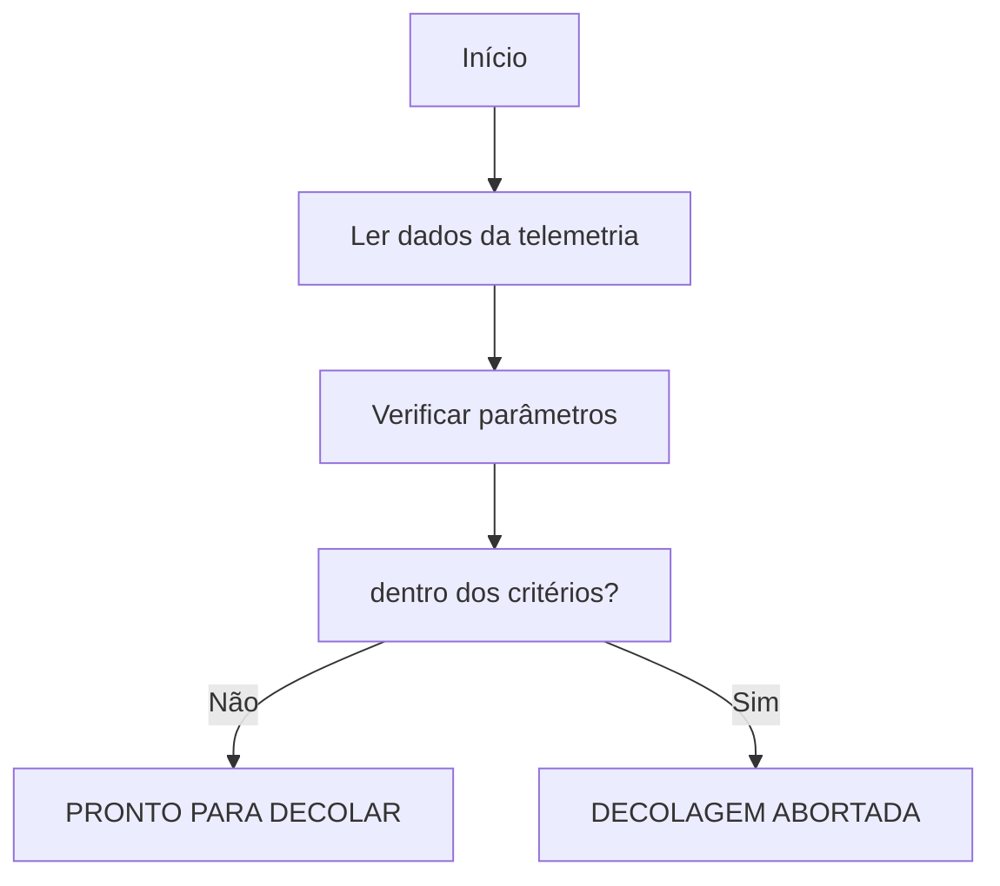

# Algoritmo de verificação pré-decolagem

## 1. Objetivo
O algoritmo de verificação pré-decolagem tem como objetivo analisar os dados de telemetria da nave Aurora Siger e determinar se as condições simuladas estão adequadas para a autorização da decolagem.

A decisão será:

* `PRONTO PARA DECOLAR`
* `DECOLAGEM ABORTADA`

---

## 2. Dados analisados

O algoritmo recebe os seguintes dados de telemetria:

|Parâmetro|	Unidade|	Condição para aprovação|
| -------------------------- | ---------- |  -------- |
|🌡️ Temperatura interna|	°C	|Entre 15 °C e 30 °C|
|🌡️ Temperatura externa|	°C	|Entre -50 °C e 50 °C|
|🏗️ Integridade estrutural|	0/1	|Deve ser igual a 1|
|⚡ Nível de energia|	%	|Entre 80% e 100%|
|⛽ Pressão dos tanques|	PSI	|Entre 150 PSI e 300 PSI|
|🔧 Módulos críticos|	Estado	|Deve estar como OK|

---

##  3. Lógica de decisão

Cada dado recebido é comparado com os critérios definidos no documento de telemetria.


> Se todos os parâmetros estiverem adequados, a decolagem será autorizada.
Se pelo menos um parâmetro apresentar uma condição inválida, a decolagem será abortada.


---

## 4. Pseudocódigo

```
INÍCIO

    Ler dados da telemetria

    Verificar:
        Temperatura interna
        Temperatura externa
        Integridade estrutural
        Nível de energia
        Pressão dos tanques
        Módulos críticos

    Todos os parâmetros estão dentro dos critérios?

    SE SIM
        Exibir "PRONTO PARA DECOLAR"

    SENÃO
        Exibir "DECOLAGEM ABORTADA"
        Exibir as falhas encontradas

FIM
```
---
## 5. Fluxograma


