# 🚀 AURORA SIGER

---

## 2. Algoritmo, Pseudocódigo e Fluxograma

---

##  2.1. Algoritmo

Um algoritmo consiste em uma sequência estruturada e ordenada de etapas que permite solucionar um problema ou executar determinada tarefa de forma lógica e sistemática.

No contexto da nave Aurora Siger, o algoritmo será responsável por analisar os dados recebidos pelo sistema de telemetria, verificar os principais parâmetros operacionais e determinar se a nave atende às condições estabelecidas para a realização do lançamento.

---

## 2.2. objetivo

O objetivo do algoritmo é realizar uma verificação automatizada das condições operacionais da nave Aurora Siger, utilizando os dados provenientes do sistema de telemetria.

Para cada parâmetro monitorado, serão estabelecidos limites aceitáveis. O sistema deverá analisar esses valores e identificar se cada condição está dentro dos critérios definidos.

Ao final da análise:

* Todos os parâmetros dentro dos limites estabelecidos: DECOLAR;
* Pelo menos um parâmetro fora dos limites estabelecidos: ABORTAR.

Dessa forma, o algoritmo contribui para uma tomada de decisão estruturada, baseada nos dados coletados pela telemetria.

---

## 2.3. Parâmetros da Telemetria

Cada parâmetro possui uma regra específica de validação.

| ID      | Parâmetro                  | Condição de validação     |
| ------- | -------------------------- | ------------------------- |
| `T_INT` | 🌡️ Temperatura interna    | `15 °C ≤ T_INT ≤ 30 °C`   |
| `T_EXT` | 🌡️ Temperatura externa    | `-50 °C ≤ T_EXT ≤ 50 °C`  |
| `STR`   | 🏗️ Integridade estrutural | `STR = 1`                 |
| `PWR`   | ⚡ Nível de energia         | `80% ≤ PWR ≤ 100%`        |
| `PRS`   | ⛽ Pressão dos tanques      | `150 PSI ≤ PRS ≤ 300 PSI` |
| `MOD`   | 🔧 Módulos críticos        | `MOD = "OK"`              |

---

### 2.3.1. Lógica de Validação

Cada parâmetro é analisado individualmente.

Temperatura interna
```text 
SE T_INT >= 15 E T_INT <= 30
    → T_INT = OK
SENÃO
    → T_INT = NOK
```
Temperatura externa
```text
SE T_EXT >= -50 E T_EXT <= 50
    → T_EXT = OK
SENÃO
    → T_EXT = NOK
```
Integridade estrutural
```text
SE STR == 1
    → STR = OK
SENÃO
    → STR = NOK
```
Nível de energia
```text
SE PWR >= 80 E PWR <= 100
    → PWR = OK
SENÃO
    → PWR = NOK
```
Pressão dos tanques
```text
SE PRS >= 150 E PRS <= 300
    → PRS = OK
SENÃO
    → PRS = NOK
```
Módulos críticos
```text
SE MOD == "OK"
    → MOD = OK
SENÃO
    → MOD = NOK
```
---

### 2.4. Regra de Decisão

Após a validação de todos os parâmetros, o algoritmo consolida os
resultados em uma única condição geral.

```text
SE todos os parâmetros forem OK
    → DECOLAR

SE pelo menos um parâmetro for NOK
    → ABORTAR
```

---

## 2.5. Definição de Pseudocódigo

O pseudocódigo é uma representação estruturada de um algoritmo utilizando
uma linguagem simplificada, próxima da linguagem humana e independente
das regras sintáticas de uma linguagem de programação específica.

Ele funciona como uma etapa intermediária entre a definição da lógica
do sistema e sua implementação em uma linguagem como Python.

No projeto Aurora Siger, o pseudocódigo permite documentar previamente
o comportamento esperado do sistema de validação da telemetria.

---

## 2.5.1 Pseudocódigo

```text
INÍCIO

    ==================================================
    1. INICIALIZAÇÃO
    ==================================================

    INICIAR sistema de telemetria

    ==================================================
    2. RECEBIMENTO DOS DADOS
    ==================================================

    RECEBER temperatura_interna
    RECEBER temperatura_externa
    RECEBER integridade_estrutural
    RECEBER nivel_energia
    RECEBER pressao_tanques
    RECEBER status_modulos

    ==================================================
    3. VALIDAÇÃO DOS PARÂMETROS
    ==================================================

    SE temperatura_interna >= 15
       E temperatura_interna <= 30 ENTÃO

        EXIBIR "Temperatura interna: OK"

    SENÃO

        EXIBIR "Temperatura interna: NOK"
        ADICIONAR "Temperatura interna" À lista de falhas
        sistema_ok ← FALSO

    FIM SE


    SE temperatura_externa >= -50
       E temperatura_externa <= 50 ENTÃO

        EXIBIR "Temperatura externa: OK"

    SENÃO

        EXIBIR "Temperatura externa: NOK"
        ADICIONAR "Temperatura externa" À lista de falhas
        sistema_ok ← FALSO

    FIM SE


    SE integridade_estrutural == 1 ENTÃO

        EXIBIR "Integridade estrutural: OK"

    SENÃO

        EXIBIR "Integridade estrutural: NOK"
        ADICIONAR "Integridade estrutural" À lista de falhas
        sistema_ok ← FALSO

    FIM SE


    SE nivel_energia >= 80
       E nivel_energia <= 100 ENTÃO

        EXIBIR "Nível de energia: OK"

    SENÃO

        EXIBIR "Nível de energia: NOK"
        ADICIONAR "Nível de energia" À lista de falhas
        sistema_ok ← FALSO

    FIM SE


    SE pressao_tanques >= 150
       E pressao_tanques <= 300 ENTÃO

        EXIBIR "Pressão dos tanques: OK"

    SENÃO

        EXIBIR "Pressão dos tanques: NOK"
        ADICIONAR "Pressão dos tanques" À lista de falhas
        sistema_ok ← FALSO

    FIM SE


    SE status_modulos == "OK" ENTÃO

        EXIBIR "Módulos críticos: OK"

    SENÃO

        EXIBIR "Módulos críticos: NOK"
        ADICIONAR "Módulos críticos" À lista de falhas
        sistema_ok ← FALSO

    FIM SE


    ==================================================
    4. DECISÃO FINAL
    ==================================================

    SE sistema_ok == VERDADEIRO ENTÃO

        EXIBIR "STATUS:DECOLAR"

    SENÃO

        EXIBIR "STATUS:ABORTAR"


        EXIBIR "Falhas identificadas:"
        EXIBIR lista de falhas

    FIM SE

FIM
```


## 2.6 Definição fluxograma

Um fluxograma é uma representação gráfica da sequência lógica de um
algoritmo.

Enquanto o pseudocódigo descreve as instruções por meio de texto, o
fluxograma utiliza blocos, decisões e conexões para representar
visualmente o fluxo de execução do sistema.

No projeto Aurora Siger, o fluxograma demonstra desde a leitura dos
dados de telemetria até a decisão final sobre a condição do lançamento.

## 2.6.1 Fluxograma

```mermaid
flowchart TD

    A([INÍCIO]) --> B[Iniciar sistema de telemetria]

    B --> C[Receber dados da telemetria]

    C --> D[Identificar parâmetros monitorados]

    D --> E{Temperatura interna<br/>15 °C ≤ T ≤ 30 °C?}

    E -- Não --> E1[Registrar falha:<br/>Temperatura interna]
    E1 --> F

    E -- Sim --> F{Temperatura externa<br/>-50 °C ≤ T ≤ 50 °C?}

    F -- Não --> F1[Registrar falha:<br/>Temperatura externa]
    F1 --> G

    F -- Sim --> G{Integridade estrutural<br/>igual a 1?}

    G -- Não --> G1[Registrar falha:<br/>Integridade estrutural]
    G1 --> H

    G -- Sim --> H{Nível de energia<br/>80% ≤ E ≤ 100%?}

    H -- Não --> H1[Registrar falha:<br/>Nível de energia]
    H1 --> I

    H -- Sim --> I{Pressão dos tanques<br/>150 ≤ P ≤ 300 PSI?}

    I -- Não --> I1[Registrar falha:<br/>Pressão dos tanques]
    I1 --> J

    I -- Sim --> J{Módulos críticos<br/>estão em OK?}

    J -- Não --> J1[Registrar falha:<br/>Módulo crítico]
    J1 --> K

    J -- Sim --> K{Existem falhas registradas?}

    K -- Não --> L[Definir status:<br/>DECOLAR]
    K -- Sim --> M[Definir status:<br/>ABORTAR]

    M --> N[Exibir falhas identificadas]

    L --> O([FIM])
    N --> O

    %% =========================
    %% ESTILIZAÇÃO
    %% =========================

    classDef inicio fill:#0D47A1,color:#FFFFFF,stroke:#082B63,stroke-width:2px;
    classDef processo fill:#E3F2FD,color:#0D47A1,stroke:#1976D2,stroke-width:1.5px;
    classDef decisao fill:#BBDEFB,color:#0D47A1,stroke:#1565C0,stroke-width:2px;
    classDef falha fill:#FFEBEE,color:#B71C1C,stroke:#C62828,stroke-width:1.5px;
    classDef sucesso fill:#E8F5E9,color:#1B5E20,stroke:#2E7D32,stroke-width:2px;
    classDef fim fill:#0D47A1,color:#FFFFFF,stroke:#082B63,stroke-width:2px;

    class A inicio;
    class B,C,D processo;
    class E,F,G,H,I,J,K decisao;
    class E1,F1,G1,H1,I1,J1,N,M falha;
    class L sucesso;
    class O fim;
```



---

## 2.8 Conclusão

O algoritmo desenvolvido para a Aurora Siger estabelece uma sequência estruturada de etapas para a análise dos principais parâmetros de telemetria da nave.

O pseudocódigo permite representar e organizar a lógica do sistema antes de sua implementação em uma linguagem de programação. Já o fluxograma apresenta essa mesma lógica de maneira visual, facilitando a compreensão do fluxo de execução e das decisões realizadas pelo sistema.

A utilização dessas três ferramentas contribui para o desenvolvimento do programa em Python, pois permite definir previamente:

* quais dados serão recebidos pelo sistema;
* quais parâmetros serão analisados;
* quais condições deverão ser verificadas;
* quais decisões deverão ser tomadas;
* em quais condições o lançamento poderá ser autorizado;
* em quais condições o lançamento deverá ser abortado.

Assim, antes da implementação do código Python, a lógica principal do sistema já se encontra estruturada e documentada. Isso facilita o desenvolvimento, a identificação de possíveis erros e a manutenção futura do programa.

> Em síntese, o algoritmo, o pseudocódigo e o fluxograma constituem a base lógica para a implementação do sistema de monitoramento e autorização de lançamento da nave Aurora Siger.
