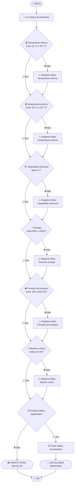

#  2. Algoritmo, Pseudocódigo e Fluxograma

## ⚙️ 2.1 Algoritmo
Um algoritmo é uma sequência de passos organizados e definidos que permite resolver um problema ou realizar uma determinada tarefa.

---

## 🎯 2.2 objetivo

Na nave Aurora Siger, o algoritmo será utilizado para analisar os dados recebidos pela telemetria, análisar os parâmetros e verificar se a nave está dentro das condições estabelecidas para realizar o lançamento.

## 📐 2.3 Parâmetros da telemetria no algoritmo

Cada parâmetro possui uma condição que determina se ele está dentro ou fora dos limites aceitáveis.

|Parâmetro|	Condição utilizada pelo algoritmo|
|---|---|
|🌡️ Temperatura interna |	Deve estar entre 15 °C e 30 °C|
|🌡️ Temperatura externa	| Deve estar entre -50 °C e 50 °C|
|🏗️ Integridade estrutural |	Deve ser igual a 1|
|⚡ Energia | Deve estar entre 80% e 100%|
|⛽ Pressão dos tanques |	Deve estar entre 150 PSI e 300 PSI|
|🔧 Módulos críticos |	Devem estar com estado OK|

SE temperatura_interna >= 15
E temperatura_interna <= 30
ENTÃO temperatura_interna = OK
SENÃO temperatura_interna = NOK

O mesmo processo é realizado para os outros parâmetros.

No final, o algoritmo verifica o resultado de todas as condições.

SE todos os parâmetros forem OK
    → 🟢 LANÇAMENTO AUTORIZADO

SE pelo menos um parâmetro for NOK
    → 🔴 LANÇAMENTO ABORTADO

## 2.4 🧩 Definição de Pseudocódigo

O pseudocódigo é uma forma de representar um algoritmo utilizando uma linguagem simples e próxima da linguagem humana, sem depender das regras específicas de uma linguagem de programação.
Ele serve como uma etapa intermediária entre a ideia do algoritmo e o código que será desenvolvido.

Na nave Aurora Siger, o pseudocódigo permite visualizar como o sistema deverá funcionar antes de transformar a lógica em código Python.

## 2.5 ⚙️ Pseudocódigo

Abaixo está o pseudocódigo utilizado para realizar a verificação dos parâmetros da Aurora Siger:

```text
INÍCIO

    📡 RECEBER dados da telemetria

    RECEBER temperatura_interna
    RECEBER temperatura_externa
    RECEBER integridade_estrutural
    RECEBER energia
    RECEBER pressao_tanques
    RECEBER status_modulos

    definir sistema_ok = VERDADEIRO

    🌡️ VERIFICAR temperatura interna
    SE temperatura_interna >= 15 E temperatura_interna <= 30
        ENTÃO mostrar "Temperatura interna: OK"
    SENÃO
        mostrar "Temperatura interna: NOK"
        sistema_ok = FALSO
    FIM SE

    🌡️ VERIFICAR temperatura externa
    SE temperatura_externa >= -50 E temperatura_externa <= 50
        ENTÃO mostrar "Temperatura externa: OK"
    SENÃO
        mostrar "Temperatura externa: NOK"
        sistema_ok = FALSO
    FIM SE

    🏗️ VERIFICAR integridade estrutural
    SE integridade_estrutural == 1
        ENTÃO mostrar "Integridade estrutural: OK"
    SENÃO
        mostrar "Integridade estrutural: NOK"
        sistema_ok = FALSO
    FIM SE

    ⚡ VERIFICAR energia
    SE energia >= 80 E energia <= 100
        ENTÃO mostrar "Energia: OK"
    SENÃO
        mostrar "Energia: NOK"
        sistema_ok = FALSO
    FIM SE

    ⛽ VERIFICAR pressão dos tanques
    SE pressao_tanques >= 150 E pressao_tanques <= 300
        ENTÃO mostrar "Pressão dos tanques: OK"
    SENÃO
        mostrar "Pressão dos tanques: NOK"
        sistema_ok = FALSO
    FIM SE

    🔧 VERIFICAR módulos críticos
    SE status_modulos == "OK"
        ENTÃO mostrar "Módulos críticos: OK"
    SENÃO
        mostrar "Módulos críticos: NOK"
        sistema_ok = FALSO
    FIM SE

    🚀 DECISÃO FINAL

    SE sistema_ok == VERDADEIRO
        ENTÃO
            mostrar "🟢 LANÇAMENTO AUTORIZADO"
    SENÃO
        mostrar "🔴 LANÇAMENTO ABORTADO"
    FIM SE

FIM
```

## 🧩 2.6 Definição fluxograma?

Um fluxograma é uma representação gráfica de um algoritmo.

Enquanto o pseudocódigo apresenta a lógica através de palavras, o fluxograma utiliza símbolos, caixas e setas para representar visualmente a sequência de execução.

## 💻 2.7 Fluxograma


## 📌 2.8 Conclusão

O algoritmo define os passos necessários para realizar a verificação da nave Aurora Siger.

O pseudocódigo permite organizar essa lógica antes da programação, enquanto o fluxograma apresenta visualmente o caminho que o sistema deverá seguir.

Essas três ferramentas facilitam o desenvolvimento do código em Python porque permitem identificar previamente:

* 📥 quais dados serão recebidos;
* 🔎 quais verificações serão realizadas;
* ⚙️ quais condições serão utilizadas;
* 🔀 quais decisões o programa deverá tomar;
* 🟢 quando o lançamento será autorizado;
* 🔴 quando o lançamento deverá ser abortado.

Assim, quando o código Python for desenvolvido, grande parte da lógica já estará definida e documentada.
